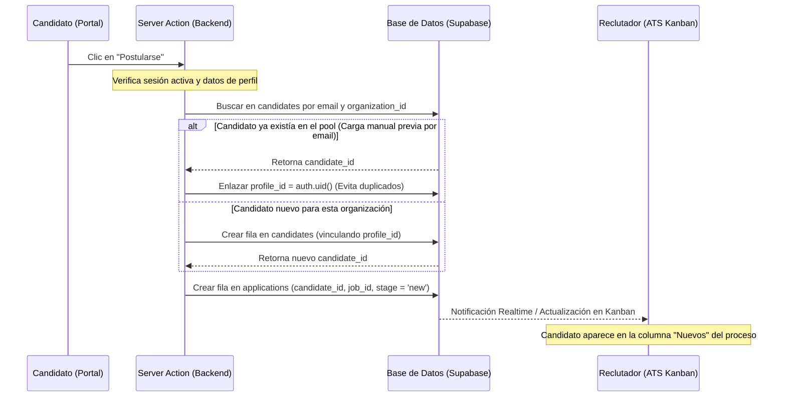

# Integración y Backend — Flujo del Candidato

Este documento detalla la arquitectura de backend, el esquema de base de datos (Supabase + Drizzle) y el flujo de integración requerido para conectar el **Portal del Candidato** con el **ATS del Reclutador (WeHunter)**.

---

## 1. Esquema de Base de Datos (Supabase / Drizzle)

El flujo del candidato interactúa directamente con el esquema unificado definido en `src/db/schema/index.ts`. La distinción clave en el modelo de WeHunter es que **el Candidato es una entidad global (fuera del tenant / multi-tenant estricto)** hasta que se postula a una búsqueda.

### 1.1 Perfil de Usuario (`profiles`)
La tabla `profiles` unifica tanto a reclutadores como a candidatos. El id es el `uuid` asignado por Supabase Auth (`auth.users.id`).

*   **Columna clave agregada:**
    *   `cv_url` (`text`): Almacena la ruta del archivo del Currículum Vitae cargado en el bucket privado de Supabase Storage.
*   **Identificación de Rol de Candidato:**
    *   Un usuario se considera **Candidato** si **NO** tiene ninguna fila vinculada en la tabla `memberships` (no pertenece a ningún tenant/organización de reclutadores).

### 1.2 Pool de Candidatos de Reclutadores (`candidates`)
Es la entidad interna de cada organización. Permite la convivencia de:
1.  Candidatos cargados a mano por el reclutador (`profile_id = null`).
2.  Candidatos registrados en la plataforma (`profile_id` asignado al usuario correspondiente).

### 1.3 Postulaciones (`applications`)
Vincula un candidato del pool con un empleo.
*   **Columnas Clave:**
    *   `job_id`: Relación con el empleo.
    *   `candidate_id`: Relación con el candidato del pool (quien a su vez tiene el `profile_id`).
    *   `stage` (`application_stage` enum): El estado de la postulación (`new`, `screening`, `interview`, etc.). Nace en `'new'` al postularse.

---

## 2. Desarrollo en el Backend de Supabase

### 2.1 Autenticación (Supabase Auth)
*   **Registro e Inicio de Sesión:**
    *   Se utiliza el proveedor de correo electrónico y contraseña estándar de Supabase.
    *   Al registrarse un nuevo usuario candidato, el trigger automático de Postgres `handle_new_user` sincroniza y crea su fila correspondiente en la tabla pública `profiles`.
*   **Metadata del Usuario:**
    *   Se sugiere guardar el rol `candidate` en los metadatos de Supabase Auth para agilizar validaciones del lado del cliente o en Edge Functions si se requiere:
        ```json
        { "role": "candidate" }
        ```

### 2.2 Storage de CVs (Supabase Storage)
Se debe configurar un bucket con las siguientes especificaciones:

*   **Nombre del Bucket:** `cvs`
*   **Privacidad:** `Privado` (Solo accesible mediante URLs firmadas temporales).
*   **Estructura de Paths:**
    *   Para CVs subidos por el candidato en su perfil global:
        `cvs/candidatos/{profile_id}/{archivo_cv.pdf}`
    *   Para CVs subidos o copiados al pool de un reclutador/organización:
        `cvs/orgs/{organization_id}/{candidate_id}/{archivo_cv.pdf}`

#### Políticas de Storage (RLS):
1.  **Lectura / Escritura del Candidato (Perfil):**
    *   Un candidato autenticado solo puede leer y escribir archivos cuyo path empiece con `cvs/candidatos/` seguido de su propio `auth.uid()`.
2.  **Lectura / Escritura del Reclutador (Pool/Procesos):**
    *   Un reclutador autenticado solo puede leer/escribir en `cvs/orgs/{organization_id}/...` si tiene un `membership` activo y válido en esa `organization_id`.

### 2.3 Políticas de Row Level Security (RLS) en Postgres

Para asegurar la privacidad y cumplir con las reglas del negocio, se deben aplicar las siguientes políticas de RLS en Supabase:

#### Tabla `jobs`
*   **Permiso SELECT para Candidatos:**
    ```sql
    create policy "candidates_read_open_jobs" on jobs
      for select
      using (status = 'open');
    ```
    *(Los candidatos solo pueden consultar búsquedas que tengan estado activo/abierto).*

#### Tabla `profiles`
*   **Permiso SELECT/UPDATE para Candidatos:**
    ```sql
    create policy "users_manage_own_profile" on profiles
      for all
      using (id = auth.uid())
      with check (id = auth.uid());
    ```

#### Tabla `applications`
*   **Permiso SELECT para Candidatos:**
    ```sql
    create policy "candidates_read_own_applications" on applications
      for select
      using (
        candidate_id in (
          select id from candidates
          where profile_id = auth.uid()
        )
      );
    ```
    *(El candidato solo ve el progreso de sus propias postulaciones).*

---

## 3. Conexión del Flujo Candidato con el ATS del Reclutador

La postulación de un candidato conecta ambos mundos mediante el siguiente flujo transaccional en el Backend/Server Action:



### Regla de Oro en la Postulación:
*   **Unificación por Email (No Duplicidad):** Si un reclutador ya había cargado los datos del candidato manualmente mediante búsqueda directa (sourcing), al momento en que el candidato se postule de manera orgánica con el mismo email, **no debemos crear un registro duplicado**. En su lugar, el sistema debe actualizar la fila existente en la tabla `candidates` seteando el `profile_id` del usuario recién autenticado.
